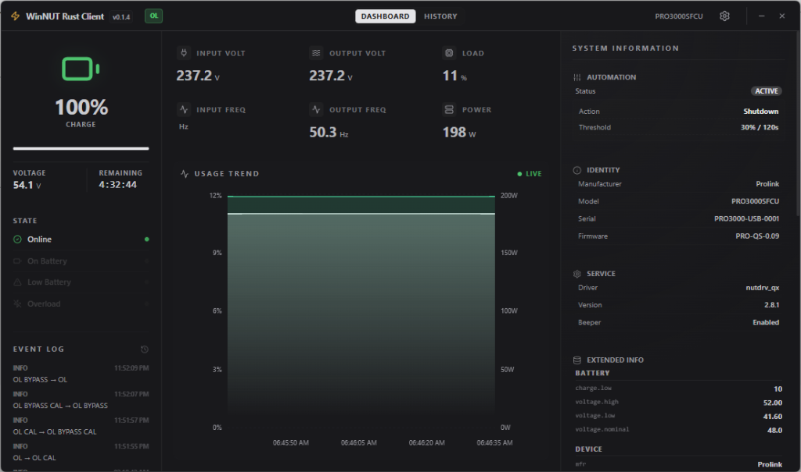

# WinNUT Rust Client 🔋

A premium, ultra-compact, and high-performance desktop utility for monitoring UPS (Uninterruptible Power Supply) systems via the NUT (Network UPS Tools) protocol. Rebuilt from the ground up with **Rust** and **Tauri v2** for a native, lightweight, and modern Windows experience.


## 📸 Preview



## 🚀 Features

- **Minimalist Premium UI**: A high-density, glassmorphic 3-panel dashboard designed for continuous monitoring without clutter.
- **Real-time Monitoring**: Low-latency polling of status, load, voltage, frequency, and battery metrics.
- **Smart Tech Integration**:
  - **Programmatic System Tray**: Dynamic status-aware tray icons (Green/Orange/Red) generated in real-time.
  - **Close-to-Tray**: Runs silently in the background; minimize to the tray to keep your system protected.
- **Advanced Automation**:
  - Conditional **Shutdown**, **Hibernate**, or **Sleep** based on battery percentage or remaining runtime.
  - **Safety First**: 15-second countdown with manual override for all automation tests.
- **Native Notifications**: Real-time Windows desktop alerts for critical power events (Power Lost, Power Restored, Low Battery).
- **Concise Event Log**: Chronological history of status changes with high-precision timestamps.
- **Smart Estimation**: Automatically calculates power consumption (Watts) and battery runtime if your UPS doesn't report them.

## 🛠️ Tech Stack

- **Backend**: Rust, Tauri v2 (High-performance system integration)
- **Frontend**: React, TypeScript, Tailwind CSS (Modern, responsive UI)
- **State Management**: Zustand with persistent storage
- **Icons**: Lucide React & Custom Programmatic RGBA Icons
- **Packaging**: NSIS & MSI (Standard Windows Installers)

## 📦 Installation

To use the client, download the latest release from the [Releases](https://github.com/your-repo/winnut-rust/releases) page.

1.  Download `WinNUT-Rust-Client-setup.exe`.
2.  Run the installer.
3.  Launch the app and enter your NUT Server details (Host, Port, User/Pass).

## 🔨 Development

To run or build the project locally, ensure you have [Bun](https://bun.sh/) and [Rust](https://www.rust-lang.org/) installed.

### Setup
```bash
# Clone the repository
git clone https://github.com/your-repo/winnut-rust.git
cd winnut-rust

# Install dependencies
bun install
```

### Run in Development
```bash
bun run tauri dev
```

### Build for Production
```bash
bun run tauri build
```

## ⚙️ Configuration

- **NUT Server**: Default port is `3493`.
- **System Commands**: Ensure the application has appropriate permissions to execute system shutdown commands. In development, run your terminal as Administrator for testing automation.
- **Persistence**: All settings (Connection, Thresholds, Power Specs) are saved locally and persist between launches.

## 📄 License

This project is licensed under the MIT License - see the LICENSE file for details.

---
*Built with ❤️ for the UPS community.*
